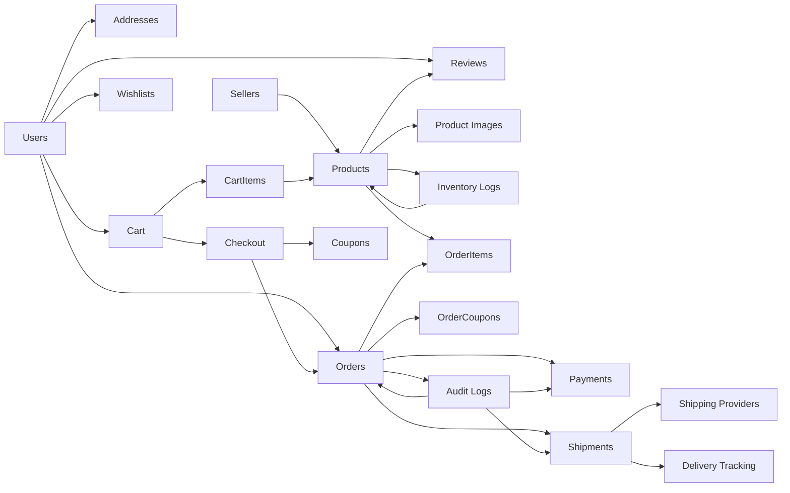
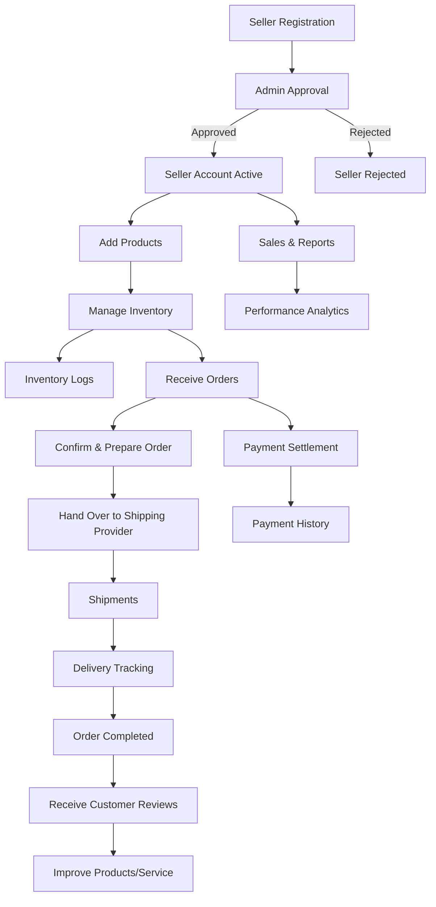
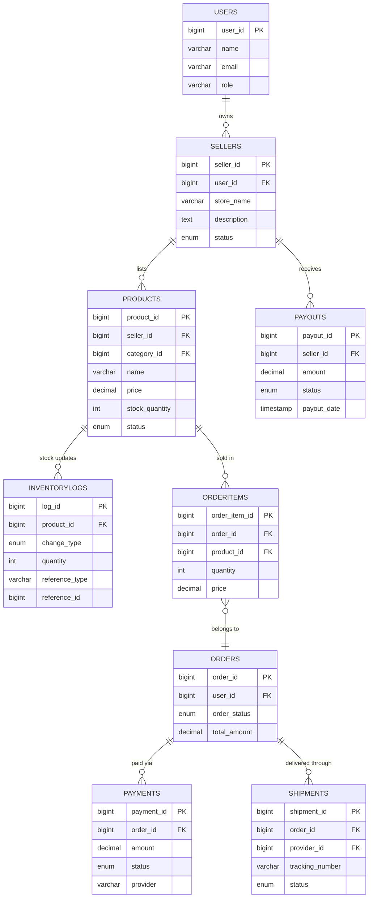

```sql
-- 1. Users / Customers
Users (
  user_id           BIGINT PK,
  first_name        VARCHAR(100),
  last_name         VARCHAR(100),
  email             VARCHAR(150) UNIQUE,
  phone             VARCHAR(20),
  password_hash     VARCHAR(255),
  role              ENUM('customer','admin','seller'),
  status            ENUM('active','inactive','banned'),
  created_at        TIMESTAMP,
  updated_at        TIMESTAMP
)

-- 2. Addresses
Addresses (
  address_id    BIGINT PK,
  user_id       BIGINT FK -> Users.user_id,
  type          ENUM('billing','shipping'),
  street        VARCHAR(255),
  city          VARCHAR(100),
  state         VARCHAR(100),
  country       VARCHAR(100),
  postal_code   VARCHAR(20),
  is_default    BOOLEAN,
  created_at    TIMESTAMP,
  updated_at    TIMESTAMP
)

-- 3. Categories
Categories (
  category_id   BIGINT PK,
  parent_id     BIGINT NULL FK -> Categories.category_id,
  name          VARCHAR(100),
  slug          VARCHAR(120) UNIQUE,
  description   TEXT,
  created_at    TIMESTAMP,
  updated_at    TIMESTAMP
)

-- 4. Products
Products (
  product_id     BIGINT PK,
  category_id    BIGINT FK -> Categories.category_id,
  name           VARCHAR(150),
  slug           VARCHAR(160) UNIQUE,
  description    TEXT,
  price          DECIMAL(10,2),
  discount_price DECIMAL(10,2) NULL,
  stock_quantity INT,
  sku            VARCHAR(50) UNIQUE,
  status         ENUM('active','inactive','out_of_stock'),
  created_at     TIMESTAMP,
  updated_at     TIMESTAMP
)

-- 5. Product Images
ProductImages (
  image_id     BIGINT PK,
  product_id   BIGINT FK -> Products.product_id,
  url          VARCHAR(255),
  alt_text     VARCHAR(150),
  is_primary   BOOLEAN,
  created_at   TIMESTAMP
)

-- 6. Shopping Cart
Cart (
  cart_id     BIGINT PK,
  user_id     BIGINT FK -> Users.user_id,
  created_at  TIMESTAMP,
  updated_at  TIMESTAMP
)

CartItems (
  cart_item_id BIGINT PK,
  cart_id      BIGINT FK -> Cart.cart_id,
  product_id   BIGINT FK -> Products.product_id,
  quantity     INT,
  price        DECIMAL(10,2), -- snapshot of product price
  created_at   TIMESTAMP
)

-- 7. Orders
Orders (
  order_id      BIGINT PK,
  user_id       BIGINT FK -> Users.user_id,
  address_id    BIGINT FK -> Addresses.address_id,
  order_status  ENUM('pending','paid','shipped','delivered','cancelled','returned'),
  total_amount  DECIMAL(10,2),
  payment_status ENUM('pending','paid','failed','refunded'),
  payment_method ENUM('card','paypal','cod','bank_transfer'),
  created_at    TIMESTAMP,
  updated_at    TIMESTAMP
)

OrderItems (
  order_item_id BIGINT PK,
  order_id      BIGINT FK -> Orders.order_id,
  product_id    BIGINT FK -> Products.product_id,
  quantity      INT,
  price         DECIMAL(10,2), -- locked price at purchase
  created_at    TIMESTAMP
)

--8. Payments
Payments (
  payment_id   BIGINT PK,
  order_id     BIGINT FK -> Orders.order_id,
  amount       DECIMAL(10,2),
  provider     VARCHAR(50),  -- Stripe, PayPal, bKash, etc.
  status       ENUM('pending','successful','failed','refunded'),
  transaction_ref VARCHAR(255),
  created_at   TIMESTAMP
)

-- 9. Reviews & Ratings
Reviews (
  review_id   BIGINT PK,
  product_id  BIGINT FK -> Products.product_id,
  user_id     BIGINT FK -> Users.user_id,
  rating      INT CHECK (rating >=1 AND rating <=5),
  comment     TEXT,
  created_at  TIMESTAMP
)

-- 10. Wishlists
Wishlists (
  wishlist_id BIGINT PK,
  user_id     BIGINT FK -> Users.user_id,
  created_at  TIMESTAMP
)

WishlistItems (
  id          BIGINT PK,
  wishlist_id BIGINT FK -> Wishlists.wishlist_id,
  product_id  BIGINT FK -> Products.product_id,
  created_at  TIMESTAMP
)

-- 🏷 Coupons / Discounts
Coupons (
  coupon_id     BIGINT PK,
  code          VARCHAR(50) UNIQUE,
  description   TEXT,
  discount_type ENUM('percentage','fixed','free_shipping'),
  discount_value DECIMAL(10,2),
  min_order_amount DECIMAL(10,2) NULL,
  max_uses      INT,
  uses_count    INT DEFAULT 0,
  start_date    DATE,
  end_date      DATE,
  status        ENUM('active','expired','disabled'),
  created_at    TIMESTAMP,
  updated_at    TIMESTAMP
)

OrderCoupons (
  id        BIGINT PK,
  order_id  BIGINT FK -> Orders.order_id,
  coupon_id BIGINT FK -> Coupons.coupon_id,
  discount_amount DECIMAL(10,2),
  created_at TIMESTAMP
)

-- 📦 Inventory Logs (Stock In/Out Tracking)
InventoryLogs (
  log_id        BIGINT PK,
  product_id    BIGINT FK -> Products.product_id,
  change_type   ENUM('in','out','adjustment'),
  quantity      INT,
  reference_id  BIGINT NULL, -- e.g. order_id, supplier shipment_id
  reference_type VARCHAR(50), -- 'order','restock','return'
  created_by    BIGINT FK -> Users.user_id,
  created_at    TIMESTAMP
)

-- 🛒 Seller Accounts & Marketplace Support
Sellers (
  seller_id     BIGINT PK,
  user_id       BIGINT FK -> Users.user_id, -- owner
  store_name    VARCHAR(150),
  description   TEXT,
  logo_url      VARCHAR(255),
  status        ENUM('active','suspended','closed'),
  created_at    TIMESTAMP,
  updated_at    TIMESTAMP
)

-- Products linked to sellers
Products (
  product_id    BIGINT PK,
  seller_id     BIGINT FK -> Sellers.seller_id,
  category_id   BIGINT FK -> Categories.category_id,
  name          VARCHAR(150),
  slug          VARCHAR(160) UNIQUE,
  description   TEXT,
  price         DECIMAL(10,2),
  discount_price DECIMAL(10,2) NULL,
  stock_quantity INT,
  sku           VARCHAR(50) UNIQUE,
  status        ENUM('active','inactive','out_of_stock'),
  created_at    TIMESTAMP,
  updated_at    TIMESTAMP
)

-- 🚚 Shipping Providers & Tracking
ShippingProviders (
  provider_id   BIGINT PK,
  name          VARCHAR(100),
  contact_email VARCHAR(150),
  contact_phone VARCHAR(50),
  api_endpoint  VARCHAR(255) NULL,
  status        ENUM('active','inactive'),
  created_at    TIMESTAMP
)

Shipments (
  shipment_id   BIGINT PK,
  order_id      BIGINT FK -> Orders.order_id,
  provider_id   BIGINT FK -> ShippingProviders.provider_id,
  tracking_number VARCHAR(100),
  status        ENUM('pending','in_transit','delivered','failed','returned'),
  shipped_at    TIMESTAMP,
  delivered_at  TIMESTAMP,
  created_at    TIMESTAMP,
  updated_at    TIMESTAMP
)

-- 🕵️ Audit Logs (Order/Payment Changes)
AuditLogs (
  audit_id      BIGINT PK,
  entity_type   VARCHAR(50),  -- 'order','payment','product','user'
  entity_id     BIGINT,
  action        VARCHAR(50),  -- 'create','update','delete','status_change'
  old_data      JSON,
  new_data      JSON,
  changed_by    BIGINT FK -> Users.user_id,
  created_at    TIMESTAMP
)

-- 🚀 Delivery Tracking (Detailed Milestones)
DeliveryTracking (
  tracking_id   BIGINT PK,
  shipment_id   BIGINT FK -> Shipments.shipment_id,
  status        ENUM('order_received','packed','shipped','in_transit','out_for_delivery','delivered','failed'),
  location      VARCHAR(255) NULL,
  remarks       TEXT,
  updated_at    TIMESTAMP
)


```

### 🛒 eCommerce Flow (with Extended Features)

1. User & Seller Setup

- Users register → create account → add Addresses.
- Sellers register → get approved → add Products under Categories.
- Each Product has stock tracked via InventoryLogs.

2. Browsing & Cart

- Customer browses Products (can filter by seller, category, etc.).
- Adds items to Cart.
- System checks stock via Products.stock_quantity.
- Optional: adds items to Wishlist.

3. Checkout & Coupons

- Customer proceeds to checkout.
- Selects Address + ShippingProvider.
- Applies Coupon (if valid).
- Discount applied → stored in OrderCoupons.

4. Order Creation

- A new Order record is created.
- OrderItems snapshot product prices & quantities.
- InventoryLogs updated (stock decreases).
- AuditLogs record order creation event.

5. Payment

- Customer selects PaymentMethod.
- Payments entry created → status initially pending.
- If gateway confirms → set to successful.
- If failed → status updated + logged in AuditLogs.

6. Shipping & Delivery

- Order is assigned to a ShippingProvider.
- A Shipment record is created with tracking_number.
- DeliveryTracking milestones update in real-time:
- order_received → packed → shipped → in_transit → out_for_delivery → delivered.
- Each update triggers push/email notifications.

7. Post-Delivery

- Customer can leave a Review for the Product.
- Seller can issue returns/refunds (update Payments + Orders + InventoryLogs).
- All updates recorded in AuditLogs.

8. Admin / Backoffice

- Admins monitor:
    - Sellers (status, performance).
    - InventoryLogs (stock outs, fraud detection).
    - Coupons (usage tracking).
    - AuditLogs (compliance & dispute resolution).



Sellers




