```php
Schema::create('users', function (Blueprint $table) {
    $table->id();
    $table->string('name');
    $table->string('email')->unique();
    $table->timestamp('email_verified_at')->nullable();
    $table->string('password');
    $table->string('username')->nullable()->unique();
    $table->string('avatar')->nullable();
    $table->string('headline')->nullable(); // short about
    $table->text('bio')->nullable();
    $table->json('settings')->nullable();
    $table->enum('role', ['student','instructor','admin'])->default('student');
    $table->rememberToken();
    $table->timestamps();
    $table->softDeletes();
});

Schema::create('instructors', function (Blueprint $table) {
    $table->id();
    $table->foreignId('user_id')->constrained('users')->cascadeOnDelete();
    $table->string('slug')->nullable()->unique();
    $table->string('company')->nullable();
    $table->string('website')->nullable();
    $table->text('bio')->nullable();
    $table->timestamps();
});

Schema::create('categories', function (Blueprint $table) {
    $table->id();
    $table->string('name');
    $table->string('slug')->unique();
    $table->foreignId('parent_id')->nullable()->constrained('categories')->nullOnDelete();
    $table->text('description')->nullable();
    $table->timestamps();
});

Schema::create('courses', function (Blueprint $table) {
    $table->id();
    $table->string('title');
    $table->string('slug')->unique();
    $table->text('short_description')->nullable();
    $table->longText('description')->nullable();
    $table->foreignId('category_id')->nullable()->constrained('categories')->nullOnDelete();
    $table->decimal('price', 10, 2)->default(0.00); // 0 = free
    $table->enum('level', ['Beginner','Intermediate','Advanced'])->default('Beginner');
    $table->enum('status', ['draft','pending_review','published','archived'])->default('draft');
    $table->integer('duration_minutes')->nullable(); // total video minutes
    $table->integer('lecture_count')->default(0);
    $table->integer('student_count')->default(0);
    $table->decimal('rating', 3, 2)->default(0.00);
    $table->boolean('is_featured')->default(false);
    $table->timestamps();
    $table->softDeletes();
});

Schema::create('course_instructors', function (Blueprint $table) {
    $table->id();
    $table->foreignId('course_id')->constrained('courses')->cascadeOnDelete();
    $table->foreignId('user_id')->constrained('users')->cascadeOnDelete(); // instructor user
    $table->boolean('is_primary')->default(false);
    $table->timestamps();
    $table->unique(['course_id','user_id']);
});

Schema::create('tags', function (Blueprint $table) {
    $table->id();
    $table->string('name')->unique();
    $table->string('slug')->unique();
    $table->timestamps();
});

Schema::create('course_tag', function (Blueprint $table) {
    $table->foreignId('course_id')->constrained('courses')->cascadeOnDelete();
    $table->foreignId('tag_id')->constrained('tags')->cascadeOnDelete();
    $table->primary(['course_id','tag_id']);
});

Schema::create('sections', function (Blueprint $table) {
    $table->id();
    $table->foreignId('course_id')->constrained('courses')->cascadeOnDelete();
    $table->string('title');
    $table->integer('position')->default(0);
    $table->timestamps();
});

Schema::create('lectures', function (Blueprint $table) {
    $table->id();
    $table->foreignId('section_id')->constrained('sections')->cascadeOnDelete();
    $table->string('title');
    $table->enum('type', ['video','text','file','quiz','assignment'])->default('video');
    $table->string('external_url')->nullable(); // e.g., Vimeo/YouTube (if used)
    $table->integer('duration_seconds')->nullable();
    $table->text('content')->nullable(); // for text lessons or description
    $table->boolean('is_preview')->default(false);
    $table->integer('position')->default(0);
    $table->timestamps();
});

Schema::create('media', function (Blueprint $table) {
    $table->id();
    $table->string('disk')->default('public');
    $table->string('path'); // relative path or CDN url
    $table->string('file_name')->nullable();
    $table->string('mime_type')->nullable();
    $table->integer('size')->nullable();
    $table->nullableMorphs('model'); // model_type, model_id => polymorphic relation
    $table->json('meta')->nullable();
    $table->timestamps();
});

Schema::create('quizzes', function (Blueprint $table) {
    $table->id();
    $table->foreignId('course_id')->constrained('courses')->cascadeOnDelete();
    $table->string('title')->nullable();
    $table->timestamps();
});

Schema::create('quiz_questions', function (Blueprint $table) {
    $table->id();
    $table->foreignId('quiz_id')->constrained('quizzes')->cascadeOnDelete();
    $table->text('question');
    $table->enum('type', ['single','multiple','true_false','short_answer'])->default('single');
    $table->json('options')->nullable(); // store choices
    $table->json('answer')->nullable(); // canonical answer(s)
    $table->timestamps();
});

Schema::create('quiz_attempts', function (Blueprint $table) {
    $table->id();
    $table->foreignId('quiz_id')->constrained('quizzes')->cascadeOnDelete();
    $table->foreignId('user_id')->constrained('users')->cascadeOnDelete();
    $table->decimal('score', 5, 2)->nullable();
    $table->json('responses')->nullable();
    $table->timestamps();
});

Schema::create('enrollments', function (Blueprint $table) {
    $table->id();
    $table->foreignId('course_id')->constrained('courses')->cascadeOnDelete();
    $table->foreignId('user_id')->constrained('users')->cascadeOnDelete();
    $table->enum('status', ['active','completed','refunded','cancelled'])->default('active');
    $table->timestamp('enrolled_at')->nullable();
    $table->timestamp('completed_at')->nullable();
    $table->unique(['course_id','user_id']);
    $table->timestamps();
});

Schema::create('orders', function (Blueprint $table) {
    $table->id();
    $table->foreignId('user_id')->constrained('users')->cascadeOnDelete();
    $table->string('order_number')->unique();
    $table->decimal('total_amount', 12, 2);
    $table->enum('status', ['pending','paid','failed','refunded','cancelled'])->default('pending');
    $table->json('meta')->nullable();
    $table->timestamps();
});

Schema::create('order_items', function (Blueprint $table) {
    $table->id();
    $table->foreignId('order_id')->constrained('orders')->cascadeOnDelete();
    $table->foreignId('course_id')->constrained('courses')->cascadeOnDelete();
    $table->decimal('price', 10, 2);
    $table->integer('quantity')->default(1);
    $table->timestamps();
});

Schema::create('transactions', function (Blueprint $table) {
    $table->id();
    $table->foreignId('order_id')->constrained('orders')->cascadeOnDelete();
    $table->string('gateway'); // stripe, paypal, etc
    $table->string('transaction_id')->nullable();
    $table->decimal('amount', 12, 2);
    $table->enum('status', ['pending','success','failed','refunded'])->default('pending');
    $table->json('response')->nullable();
    $table->timestamps();
});

Schema::create('reviews', function (Blueprint $table) {
    $table->id();
    $table->foreignId('course_id')->constrained('courses')->cascadeOnDelete();
    $table->foreignId('user_id')->constrained('users')->cascadeOnDelete();
    $table->tinyInteger('rating')->unsigned(); // 1..5
    $table->text('body')->nullable();
    $table->boolean('is_approved')->default(true);
    $table->unique(['course_id','user_id']); // one review per user per course
    $table->timestamps();
});

Schema::create('coupons', function (Blueprint $table) {
    $table->id();
    $table->string('code')->unique();
    $table->enum('type', ['percentage','fixed'])->default('percentage');
    $table->decimal('value', 10, 2);
    $table->timestamp('starts_at')->nullable();
    $table->timestamp('expires_at')->nullable();
    $table->integer('usage_limit')->nullable();
    $table->integer('usage_count')->default(0);
    $table->json('meta')->nullable(); // restrictions: course ids, instructor ids, min purchase, etc
    $table->timestamps();
});

Schema::create('coupon_redemptions', function (Blueprint $table) {
    $table->id();
    $table->foreignId('coupon_id')->constrained('coupons')->cascadeOnDelete();
    $table->foreignId('user_id')->constrained('users')->cascadeOnDelete();
    $table->foreignId('order_id')->nullable()->constrained('orders')->nullOnDelete();
    $table->timestamps();
});

Schema::create('wishlists', function (Blueprint $table) {
    $table->id();
    $table->foreignId('user_id')->constrained('users')->cascadeOnDelete();
    $table->foreignId('course_id')->constrained('courses')->cascadeOnDelete();
    $table->unique(['user_id','course_id']);
    $table->timestamps();
});

Schema::create('certificates', function (Blueprint $table) {
    $table->id();
    $table->foreignId('user_id')->constrained('users')->cascadeOnDelete();
    $table->foreignId('course_id')->constrained('courses')->cascadeOnDelete();
    $table->string('certificate_number')->unique();
    $table->timestamp('issued_at')->nullable();
    $table->string('file_path')->nullable(); // if storing generated PDF
    $table->timestamps();
});

Schema::create('notifications', function (Blueprint $table) {
    $table->id();
    $table->foreignId('user_id')->constrained('users')->cascadeOnDelete();
    $table->string('type'); // course_enrolled, course_published, etc
    $table->json('data')->nullable();
    $table->boolean('read')->default(false);
    $table->timestamps();
});

Schema::create('lecture_progress', function (Blueprint $table) {
    $table->id();
    $table->foreignId('lecture_id')->constrained('lectures')->cascadeOnDelete();
    $table->foreignId('user_id')->constrained('users')->cascadeOnDelete();
    $table->integer('watched_seconds')->default(0);
    $table->timestamp('last_watched_at')->nullable();
    $table->unique(['lecture_id','user_id']);
    $table->timestamps();
});

```

```mermaid
erDiagram
    USERS {
        bigint id PK
        string name
        string email UK
        string password
        string role "student|instructor|admin"
    }

    INSTRUCTORS {
        bigint id PK
        bigint user_id FK
        string slug
        text bio
    }

    CATEGORIES {
        bigint id PK
        string name
        string slug UK
        bigint parent_id FK
    }

    COURSES {
        bigint id PK
        string title
        string slug UK
        text short_description
        longtext description
        decimal price
        enum level "Beginner|Intermediate|Advanced"
        enum status "draft|pending_review|published|archived"
        bigint category_id FK
    }

    COURSE_INSTRUCTORS {
        bigint id PK
        bigint course_id FK
        bigint user_id FK
    }

    TAGS {
        bigint id PK
        string name
        string slug UK
    }

    COURSE_TAG {
        bigint course_id FK
        bigint tag_id FK
    }

    SECTIONS {
        bigint id PK
        bigint course_id FK
        string title
        int position
    }

    LECTURES {
        bigint id PK
        bigint section_id FK
        string title
        enum type "video|text|file|quiz|assignment"
        int duration_seconds
        bool is_preview
    }

    QUIZZES {
        bigint id PK
        bigint course_id FK
        string title
    }

    QUIZ_QUESTIONS {
        bigint id PK
        bigint quiz_id FK
        text question
        enum type "single|multiple|true_false|short_answer"
    }

    QUIZ_ATTEMPTS {
        bigint id PK
        bigint quiz_id FK
        bigint user_id FK
        decimal score
    }

    ENROLLMENTS {
        bigint id PK
        bigint course_id FK
        bigint user_id FK
        enum status "active|completed|refunded|cancelled"
    }

    ORDERS {
        bigint id PK
        bigint user_id FK
        string order_number
        decimal total_amount
        enum status "pending|paid|failed|refunded|cancelled"
    }

    ORDER_ITEMS {
        bigint id PK
        bigint order_id FK
        bigint course_id FK
        decimal price
        int quantity
    }

    TRANSACTIONS {
        bigint id PK
        bigint order_id FK
        string gateway
        string transaction_id
        decimal amount
        enum status "pending|success|failed|refunded"
    }

    REVIEWS {
        bigint id PK
        bigint course_id FK
        bigint user_id FK
        tinyint rating
        text body
    }

    WISHLISTS {
        bigint id PK
        bigint user_id FK
        bigint course_id FK
    }

    CERTIFICATES {
        bigint id PK
        bigint user_id FK
        bigint course_id FK
        string certificate_number UK
    }

    COUPONS {
        bigint id PK
        string code UK
        enum type "percentage|fixed"
        decimal value
    }

    COUPON_REDEMPTIONS {
        bigint id PK
        bigint coupon_id FK
        bigint user_id FK
        bigint order_id FK
    }

    MEDIA {
        bigint id PK
        string disk
        string path
        string file_name
        string mime_type
        int size
        string model_type
        bigint model_id
    }

    %% Relationships
    USERS ||--o{ INSTRUCTORS : "has"
    USERS ||--o{ ENROLLMENTS : "enrolls"
    USERS ||--o{ ORDERS : "places"
    USERS ||--o{ REVIEWS : "writes"
    USERS ||--o{ WISHLISTS : "saves"
    USERS ||--o{ QUIZ_ATTEMPTS : "attempts"
    USERS ||--o{ CERTIFICATES : "receives"

    INSTRUCTORS ||--o{ COURSE_INSTRUCTORS : "teaches"
    COURSES ||--o{ COURSE_INSTRUCTORS : "has"
    CATEGORIES ||--o{ COURSES : "categorizes"
    COURSES ||--o{ SECTIONS : "contains"
    SECTIONS ||--o{ LECTURES : "has"
    COURSES ||--o{ QUIZZES : "has"
    QUIZZES ||--o{ QUIZ_QUESTIONS : "has"
    QUIZZES ||--o{ QUIZ_ATTEMPTS : "records"
    COURSES ||--o{ ENROLLMENTS : "has"
    COURSES ||--o{ ORDER_ITEMS : "sold in"
    ORDERS ||--o{ ORDER_ITEMS : "includes"
    ORDERS ||--o{ TRANSACTIONS : "records"
    COURSES ||--o{ REVIEWS : "receives"
    COURSES ||--o{ WISHLISTS : "in"
    COURSES ||--o{ CERTIFICATES : "issues"
    COUPONS ||--o{ COUPON_REDEMPTIONS : "used in"
    ORDERS ||--o{ COUPON_REDEMPTIONS : "applied to"
    TAGS ||--o{ COURSE_TAG : "tags"
    COURSES ||--o{ COURSE_TAG : "has"
    MEDIA ||--o{ COURSES : "attached to (polymorphic)"
```


